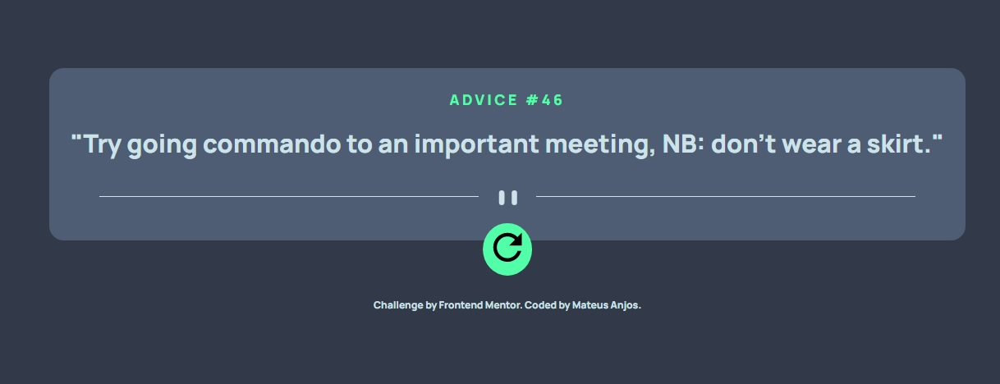
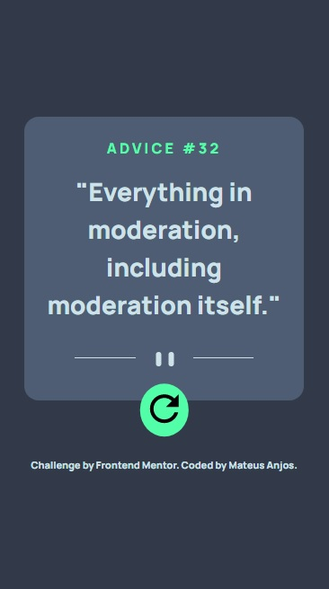

# Frontend Mentor - Advice generator app solution

Esta é uma solução para o desafio [Advice generator app challenge on Frontend Mentor](https://www.frontendmentor.io/challenges/advice-generator-app-QdUG-13db).

### O Desafio
O desafio era construir uma aplicação geradora de conselhos usando a [Advice Slip API](https://api.adviceslip.com) ao mesmo tempo que o design deve se manter o mais fiel ao proposto pelo desafio. 

Os usuários devem ser capazes de:

- Ver o layout otimizado da aplicação dependendo da tela do aparelho utilizado pelo usuário 
- Ver os estados de hover para todos elementos interativos da página 
- gerar um novo conselho sempre que clicarem no botão de refresh 

### Screenshots

Desktop App

Mobile App

### Links

- Live Site URL: [Add live site URL here](https://your-live-site-url.com)

### O que aprendi

Desafio foi extremamente interessante pois foi um dos meus primeiros contatos consumindo uma API por conta própria. Já havia executado em outros projetos onde segui tutoriais mas, entendendo o código e por conta própria, esta foi a primeira vez.

Além disso, acabei aprendendo a função animate() para executar animações CSS via Javascript. Isso foi um extra em relação ao desafio pois quis um botão mais intuitivo e que segurasse o conselho na tela por 2 segundos, tempo necessário para a API atualizar e fornecer um novo conselho. 

## Autor

- Linkedin - [Mateus Anjos](https://www.linkedin.com/in/mateus-anjos-3390aaaa/)
- Frontend Mentor - [@mateusAnjos](https://www.frontendmentor.io/profile/mateusAnjos)
- Twitter - [@mateuslimao_](https://twitter.com/mateuslimao_)
